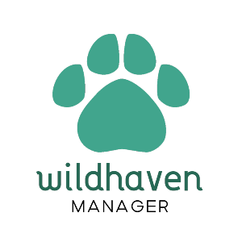

# CloudComputing1MII
Prácticas de Cloud Computing I del Master en Ingeniería Informática en la UGR

## Proyecto WildHaven
WildHaven es una aplicación que simplifica la gestión integral de protectoras y santuarios de animales. Desde el seguimiento del bienestar animal hasta la coordinación de voluntarios, adopciones responsables y recaudación de fondos, ofrece una plataforma eficiente y todo-en-uno. Con herramientas intuitivas y automatizadas, WildHaven permite a estas organizaciones enfocarse en su misión principal: proteger y cuidar a los animales.

### Configuración del repositorio
[La primera parte del hito 1 (h1a)](https://github.com/SergioHrvas/CloudComputing1MII/blob/main/hitos/h1a.md) consiste en crear y configurar el repositorio en Github para preparar el futuro desarrollo de nuestro proyecto.

### Descripción del problema
[Para acabar el hito 1 (h1b)](https://github.com/SergioHrvas/CloudComputing1MII/blob/main/hitos/h1b.md) explicaremos el problema planteado y describiremos su solución software. En este caso se plantea un sistema para la gestión de un santuario o protectora de animales: WildHaven

### Integración continua
[El segundo hito](https://github.com/SergioHrvas/CloudComputing1MII/blob/main/hitos/h2.md) implementará un sistema de integración continua (CI), aspecto fundamental en el desarrollo de WildHaven. Este proceso asegura que cada modificación en el código sea automáticamente compilada, probada y revisada, lo que facilita la detección temprana de errores y mantiene la calidad del código.

### Diseño de microservicios
[El hito 3](https://github.com/SergioHrvas/CloudComputing1MII/blob/main/hitos/h3.md) se centra en el desarrollo de un microservicio, donde se implementa una API diseñada con un enfoque por capas que separa la lógica de negocio. Incluye la elección y justificación del framework utilizado, la integración de un sistema de logs para registrar la actividad de la API, y la creación de pruebas automatizadas para asegurar su correcto funcionamiento. Además, se busca una documentación adecuada que respalde el diseño y las decisiones tomadas a lo largo del proceso, garantizando un sistema escalable, mantenible y bien gestionado.

### Composición de contenedores
En el [cuarto hito](https://github.com/SergioHrvas/CloudComputing1MII/blob/main/hitos/h4.md), se compondrán contenedores con el objetivo de garantizar un entorno de ejecución uniforme y eficiente para las aplicaciones involucradas. El uso de contenedores facilita el despliegue, la escalabilidad y la consistencia entre entornos de desarrollo, prueba y producción.

### Despliegue de la aplicación en un IaaS
En el [quinto hito](https://github.com/SergioHrvas/CloudComputing1MII/blob/main/hitos/h5.md), se llevará a cabo el despliegue de la aplicación desarrollada en un proveedor de **Infraestructura como Servicio (IaaS)**. Este proceso tiene como objetivo alojar los contenedores previamente configurados en un entorno de nube para garantizar la accesibilidad, escalabilidad y disponibilidad de la aplicación en un entorno de producción.
