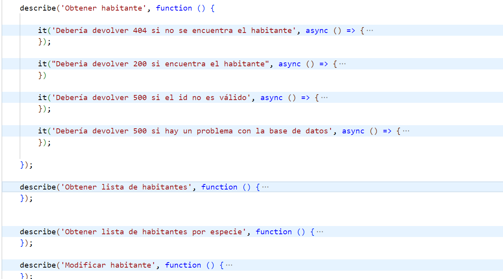

# HITO 2 - INTEGRACIÓN CONTINUA

## GESTOR DE TAREAS

### ELECCIÓN


He decidido utilizar **npm** como gestor de tareas porque:

1. **Estándar en Node.js**: Es el gestor de paquetes predeterminado y ampliamente aceptado en la comunidad.
2. **Facilidad de Uso**: Su interfaz es intuitiva, simplificando la gestión de dependencias y la ejecución de scripts.
3. **Preinstalado**: Viene incluido con Node.js, lo que facilita su uso desde el inicio.
4. **Experiencia Previa**: Ya he utilizado npm en proyectos anteriores, lo que reduce la curva de aprendizaje.

Estas razones hacen de npm la opción más adecuada para mi proyecto de Node.js frente a otras alternativas como Yarn, pnpm o Bower

**npm** (Node Package Manager) es el gestor de paquetes predeterminado para Node.js, que permite a los desarrolladores instalar y gestionar dependencias de sus aplicaciones. Además, npm ofrece funcionalidades que facilitan la automatización de tareas mediante scripts, convirtiéndose en un gestor de tareas eficaz.
  
 <br>  
  

**¿Cómo utilizaré npm en la integración continua?**

1. **Definir Scripts**:
   - En el archivo `package.json`, agregaré scripts personalizados bajo la sección `scripts`. Por ejemplo, un script para ejecutar pruebas:

     ```json
     "scripts": {
       "test": "mocha"
     }
     ```

2. **Ejecutar Scripts**:
   - Para ejecutar un script, usaré el comando `npm run <comando>`, lo que me permitirá ejecutar tareas de manera sencilla.

### USO DE NPM
Se ha escrito el comando a ejecutar en el fichero "package.json" del proyecto de NodeJS.
Para ejecutar cada uno de los comandos, es tan fácil como escribir "npm run <comando>. Se ha agregado un comando general para ejecutar todos los tests y cuatro específicos para aislar la ejecución de los test de cada uno de los modelos.


Un ejemplo de la ejecución sería:




## BIBLIOTECA DE ASERCIONES
### ELECCIÓN

Para las pruebas de mi proyecto en Node.js, he decidido utilizar **Chai** como biblioteca de aserciones. Chai es flexible y permite realizar comparaciones de resultados esperados y obtenidos en un estilo claro y legible, soportando tanto **BDD** (Behavior-Driven Development) como **TDD** (Test-Driven Development). Esto me da la libertad de escribir pruebas de forma intuitiva y alineada a los requisitos de cada prueba, aunque en este caso, he optado más por un enfoque BDD, ya que me permite describir el comportamiento esperado del sistema de forma que sea más legible y comprensible, especialmente útil al crear pruebas que se alinean directamente con los requisitos de negocio. Pese a que otras opciones populares incluyen Jest, que es un marco de prueba completo con su propio test runner y aserciones, y Should.js, que también ofrece un estilo expresivo para pruebas de BDD, Chai se integra sin problemas con Mocha como test runner y me proporciona la flexibilidad de adaptar mi estilo de aserciones a diferentes tipos de pruebas en mi proyecto.

Si además de Node.js hubiera implementado pruebas en Angular, habría elegido Jest como biblioteca de pruebas, ya que es compatible con ambos entornos. Jest destaca por su rapidez y facilidad de configuración, lo que lo convierte en una opción eficiente para pruebas en JavaScript y TypeScript.

### USO DE CHAI
Instalamos chai y chai-http con nuestro gestor de paquetes npm.

````
npm chai chai-http
````

Una vez instalado chai en nuestro proyecto, creamos los distintos archivos donde se implementarán las pruebas.

Sin meterme en el código de cada prueba, es importante saber que se han agrupado las pruebas por los distintos modelos que existen en el sistema y, a su vez, por funcionalidad. Para esto, Chai proporciona la función "describe" que ayuda a mantener las pruebas (función "it") de forma organizada y ordenada.


# TEST RUNNER
### ELECCIÓN
He decidido utilizar **Mocha** como test runner para el proyecto por su flexibilidad y capacidad de adaptación a diferentes estilos de pruebas y necesidades de desarrollo. Mocha permite estructurar y ejecutar pruebas de forma intuitiva mediante funciones como describe e it, lo cual facilita organizar el código de pruebas y mantener la legibilidad. Al ser compatible con múltiples bibliotecas de aserciones como Chai, Mocha se convierte en una herramienta versátil que se adapta bien tanto al desarrollo guiado por pruebas (TDD) como al desarrollo guiado por comportamiento (BDD).

Además, Mocha destaca por su capacidad para generar informes detallados y configurables, lo que permite analizar los resultados de cada prueba y realizar un seguimiento exhaustivo de los posibles errores. También es extensible, facilitando la integración con bibliotecas de simulación y herramientas adicionales que ayudan a realizar pruebas más completas.

Aunque existen alternativas como Jest o Jasmine que ofrecen un entorno de prueba completo, Mocha proporciona un control granular y una mayor compatibilidad con herramientas externas, lo cual es ideal para un proyecto en Node.js donde se busca flexibilidad sin comprometer el rendimiento. En resumen, Mocha es una elección sólida que permite un control preciso y una integración eficiente en un entorno de pruebas Node.js.


### USO DE MOCHA
Como ya hemos adelantado antes, Mocha se utilizará principalmente junto con el gestor de tareas elegido (npm).

Sin embarbo, es posible utilizar Mocha de forma aislada mediante los comandos que se proporcionan en los scripts.

Por ejemplo, el siguiente comando ejecutaría las pruebas de los endpoints de las zonas del santuario
```
mocha .\test\zone.test.js 
```

Que nos daría el siguiente resultado


## INTEGRACIÓN DE PRUEBAS
Se han desarrollado 82 pruebas en total sobre los distintos endpoints creados. Estas pruebas abarcan tanto peticiones satisfechas con resultados correctos como errores de parámetros, de conexión, etc. Para las pruebas, en el directorio *test* del backend se ha creado un fichero por cada modelo:
  - **usuario.test.js**: Abarca las pruebas sobre las rutas relacionadas con la gestión de los usuarios, incluido el login y el registro.
  - **zone.test.js**: Pruebas sobre los endpoints de gestión de las zonas del santuario
  - **specie.test.js**: Pruebas sobre los endpoints de gestión de las especies del santuario
  - **inhabitant.test.js**: Pruebas sobre los endpoints de gestión de los habitantes del santuario

A continuación, se presenta una lista resumida de los diferentes tests implementados
### Habitantes
- **Obtener habitante**
  - Debería devolver 404 si no se encuentra el habitante (cuando el ID no existe en la base de datos).
  - Debería devolver 200 si encuentra el habitante (cuando se encuentra el habitante con el ID proporcionado).
  - Debería devolver 500 si el ID no es válido (cuando el formato del ID es incorrecto).
  - Debería devolver 500 si hay un problema con la base de datos (si ocurre un error en la conexión o consulta).

- **Obtener lista de habitantes**
  - Debería devolver 200 si hay habitantes (cuando se encuentran habitantes en la base de datos).
  - Debería devolver 404 si no hay habitantes (cuando no hay habitantes registrados en la base de datos).
  - Debería devolver 500 si hay un error con la base de datos (cuando ocurre un error al intentar obtener la lista).

- **Obtener lista de habitantes por especie**
  - Debería devolver 200 si hay habitantes (cuando se encuentran habitantes asociados a la especie).
  - Debería devolver 404 si no hay habitantes (cuando no se encuentran habitantes para la especie).
  - Debería devolver 500 si hay un error con la base de datos (cuando ocurre un error en la consulta por especie).

- **Modificar habitante**
  - Debería devolver 200 si se ha modificado (cuando se realiza la modificación correctamente).
  - Debería devolver 500 si ya están los datos (cuando los datos proporcionados ya existen en el sistema).
  - Debería devolver 500 si el ID no es válido (cuando el formato del ID es incorrecto).
  - Debería devolver 500 si hay un error con la base de datos (cuando ocurre un error durante la modificación).

- **Crear habitante**
  - Debería devolver 200 si se ha creado el habitante (cuando el habitante se registra correctamente).
  - Debería devolver 400 si no se ha enviado algún dato obligatorio (si faltan campos requeridos).
  - Debería devolver 500 si hay un error con la base de datos (si ocurre un error en la creación).

- **Eliminar habitante**
  - Debería devolver 200 si se ha eliminado el habitante (cuando se elimina el habitante correctamente).
  - Debería devolver 404 si no se ha encontrado el habitante (cuando el habitante no existe).
  - Debería devolver 500 si el ID no es válido (cuando el formato del ID es incorrecto).
  - Debería devolver 500 si hay un error con la base de datos (cuando ocurre un error en la eliminación).

### Especies
- **Obtener especie**
  - Debería devolver 404 si no se encuentra la especie (cuando no se encuentra la especie con el ID).
  - Debería devolver 200 si encuentra la especie (cuando la especie existe en la base de datos).
  - Debería devolver 500 si el ID no es válido (cuando el formato del ID es incorrecto).
  - Debería devolver 500 si hay un problema con la base de datos (cuando ocurre un error en la conexión).

- **Obtener lista de especies**
  - Debería devolver 200 si hay especies (cuando existen especies registradas en la base de datos).
  - Debería devolver 404 si no hay especies (cuando no hay especies en la base de datos).
  - Debería devolver 500 si hay un error con la base de datos (cuando ocurre un error en la consulta).

- **Modificar especie**
  - Debería devolver 200 si se ha modificado (cuando se actualizan los datos correctamente).
  - Debería devolver 500 si ya están los datos (cuando los datos ya existen en la base de datos).
  - Debería devolver 500 si el ID no es válido (cuando el formato del ID es incorrecto).
  - Debería devolver 500 si hay un error con la base de datos (cuando ocurre un error durante la modificación).

- **Crear especie**
  - Debería devolver 200 si se ha creado la especie (cuando la especie se registra correctamente).
  - Debería devolver 400 si el nombre de la especie está repetido (si el nombre ya existe en la base de datos).
  - Debería devolver 400 si no se ha enviado algún dato obligatorio (si faltan campos necesarios).
  - Debería devolver 500 si hay un error con la base de datos (cuando ocurre un error en la creación).

- **Eliminar especie**
  - Debería devolver 200 si se ha eliminado la especie (cuando se elimina la especie correctamente).
  - Debería devolver 404 si no se ha encontrado la especie (cuando la especie no existe en la base de datos).
  - Debería devolver 500 si el ID no es válido (cuando el formato del ID es incorrecto).
  - Debería devolver 500 si hay un error con la base de datos (cuando ocurre un error en la eliminación).

### Usuarios
- **Obtener usuario**
  - Debería devolver 404 si no se encuentra el usuario (cuando no existe el usuario con el ID).
  - Debería devolver 200 si encuentra el usuario (cuando el usuario se encuentra en la base de datos).
  - Debería devolver 500 si el ID no es válido (cuando el formato del ID es incorrecto).
  - Debería devolver 500 si hay un problema con la base de datos (cuando ocurre un error en la conexión).

- **Obtener lista de usuarios**
  - Debería devolver 200 si hay usuarios (cuando existen usuarios en la base de datos).
  - Debería devolver 404 si no hay usuarios (cuando no hay registros de usuarios).
  - Debería devolver 500 si hay un error con la base de datos (cuando ocurre un error en la consulta).

- **Modificar usuario**
  - Debería devolver 200 si se ha modificado (cuando el usuario se actualiza correctamente).
  - Debería devolver 403 si no permite la edición del usuario (cuando no tiene permisos).
  - Debería devolver 500 si el ID no es válido (cuando el formato del ID es incorrecto).
  - Debería devolver 500 si hay un error con la base de datos (cuando ocurre un error en la modificación).

- **Crear usuario**
  - Debería devolver 200 si se ha registrado el usuario (cuando se registra correctamente).
  - Debería devolver 400 si el correo está repetido (cuando el correo ya existe).
  - Debería devolver 400 si no se ha enviado algún dato obligatorio (si faltan campos necesarios).
  - Debería devolver 500 si hay un error con la base de datos (cuando ocurre un error en la creación).

- **Eliminar usuario**
  - Debería devolver 200 si se ha eliminado el usuario (cuando se elimina correctamente).
  - Debería devolver 404 si no se ha encontrado el usuario (cuando el usuario no existe).
  - Debería devolver 500 si el ID no es válido (cuando el formato del ID es incorrecto).
  - Debería devolver 500 si hay un error con la base de datos (cuando ocurre un error en la eliminación).

- **Login de usuario**
  - Debería devolver 200 si se ha logueado el usuario (cuando las credenciales son correctas).
  - Debería devolver 404 si no se ha encontrado el usuario (cuando el usuario no existe).
  - Debería devolver 404 si la contraseña no es válida (cuando la contraseña es incorrecta).
  - Debería devolver 500 si hay un error con la base de datos (cuando ocurre un error en la autenticación).

### Zonas
- **Obtener zona**
  - Debería devolver 404 si no se encuentra la zona (cuando el ID no existe).
  - Debería devolver 200 si encuentra la zona (cuando la zona se encuentra en la base de datos).
  - Debería devolver 500 si el ID no es válido (cuando el formato del ID es incorrecto).
  - Debería devolver 500 si hay un problema con la base de datos (cuando ocurre un error en la conexión).

- **Obtener lista de zonas**
  - Debería devolver 200 si hay zonas (cuando existen zonas en la base de datos).
  - Debería devolver 404 si no hay zonas (cuando no hay registros de zonas).
  - Debería devolver 500 si hay un error con la base de datos (cuando ocurre un error en la consulta).

- **Modificar zona**
  - Debería devolver 200 si se ha modificado (cuando la zona se actualiza correctamente).
  - Debería devolver 500 si ya están los datos (cuando los datos ya existen).
  - Debería devolver 500 si el ID no es válido (cuando el formato del ID es incorrecto).
  - Debería devolver 500 si hay un error con la base de datos (cuando ocurre un error en la modificación).

- **Crear zona**
  - Debería devolver 200 si se ha creado la zona (cuando se registra correctamente).
  - Debería devolver 400 si el nombre de la zona está repetido (cuando el nombre ya existe).
  - Debería devolver 400 si no se ha enviado algún dato obligatorio (si faltan campos requeridos).
  - Debería devolver 500 si hay un error con la base de datos (cuando ocurre un error en la creación).

- **Eliminar zona**
  - Debería devolver 200 si se ha eliminado la zona (cuando se elimina correctamente).
  - Debería devolver 404 si no se ha encontrado la zona (cuando la zona no existe).
  - Debería devolver 500 si el ID no es válido (cuando el formato del ID es incorrecto).
  - Debería devolver 500 si hay un error con la base de datos (cuando ocurre un error en la eliminación).


## TEST RUNNER ONLINE
### ELECCIÓN
He elegido **GitHub Actions** como sistema de integración continua para mi proyecto por su integración nativa con GitHub y su flexibilidad. Permite automatizar flujos de trabajo que se activan con eventos como push y pull requests, lo que garantiza que las pruebas se ejecuten automáticamente cada vez que realizo un cambio en el código.

Con GitHub Actions, puedo configurar fácilmente un flujo de trabajo mediante archivos YAML, lo que me permite instalar dependencias y ejecutar pruebas con Mocha de forma eficiente. Esta automatización no solo asegura la estabilidad del código, sino que también proporciona informes detallados sobre los resultados de las pruebas, facilitando la identificación de problemas. 

Otras alternativas de integración continua que podrían haberse considerado incluyen herramientas como Jenkins, Travis CI y CircleCI. Jenkins es una opción muy popular por su flexibilidad y extensibilidad, ya que permite personalizar profundamente los flujos de trabajo mediante plugins; sin embargo, requiere más mantenimiento, lo que implica dedicar más tiempo a su configuración y administración. Travis CI y CircleCI, por otro lado, ofrecen una integración fluida con GitHub y son conocidas por su simplicidad y facilidad de uso, pero sus características completas suelen estar limitadas a versiones de pago para proyectos privados.

### USO DE GITHUB ACTIONS
Para poder realizar la integración continua con github actions he tenido que crear el directorio .github/workflows en mi espacio de trabajo de git. En esta localización se ha creado un fichero llamado *github-actions.yml*. Aquí se han configurado los servicios y tecnologías a utilizar (node y mongo en este caso) y los comandos que se ejecutarán cada vez que se realice un push o pull request en la rama main en el repositorio de Git. Esto asegura que todas las actualizaciones pasen por una serie de pruebas antes de integrarse completamente en el proyecto. Con dicho fichero también se instalan dependencias y se ejecutan las pruebas de forma automática en un contenedor de GitHub Actions. Esto además permite verificar que el código funciona como se espera antes de cualquier fusión en la rama principal.

Los pasos que se dan en mi fichero son:
- **Clonar el repositorio:**
Se clona el repositorio utilizando ```actions/checkout@v4```, lo que asegura que el código esté disponible para su ejecución.

- **Configurar la versión de Node.js:**
Se establece la versión de Node.js a utilizar (20 en este caso) mediante ```actions/setup-node@v4```.

- **Instalar dependencias:**
Se ejecuta ```npm install``` en el directorio ```./WildHaven/backend``` para instalar las dependencias del proyecto.

- **Esperar a que MongoDB esté listo:**
Se utiliza un script en el que se espera hasta que MongoDB esté disponible en el puerto 27017. Esto se realiza mediante el comando ```nc -z localhost 27017```, que verifica la disponibilidad del puerto.

- **Ejecutar las pruebas:**
Se ejecuta ```npm test``` en el directorio ```./WildHaven/backend``` para ejecutar las pruebas del proyecto. Además, se define una variable de entorno *MONGODB_URI* con el URI de MongoDB local ```(mongodb://localhost:27017/wildhaven-test)```, lo que asegura que las pruebas se conecten a la base de datos de pruebas.

- **Listar los archivos del repositorio:**
Se ejecuta el comando ```ls ${{ github.workspace }}```, que lista todos los archivos en el espacio de trabajo de GitHub Actions para verificar qué archivos están presentes en el entorno de ejecución.

- **Mostrar el estado del trabajo:**
Finalmente, se imprime un mensaje con el estado del trabajo utilizando ```echo "🍏 This job's status is ${{ job.status }}".``` Esto ayuda a visualizar si el trabajo fue exitoso o falló.
5. **Ventajas de la integración continua**  
   Esta configuración de integración continua permite detectar problemas en el código de manera temprana, asegurando que el proyecto siempre se mantenga en un estado funcional. Además, facilita el trabajo en equipo y reduce el riesgo de introducir errores en el código principal.

--- 

Este flujo de trabajo automático en GitHub Actions


