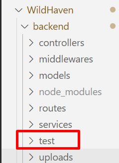

# HITO 2 - INTEGRACIÓN CONTINUA

## GESTOR DE TAREAS


He decidido utilizar **npm** como gestor de tareas porque:

1. **Estándar en Node.js**: Es el gestor de paquetes predeterminado y ampliamente aceptado en la comunidad.
2. **Facilidad de Uso**: Su interfaz es intuitiva, simplificando la gestión de dependencias y la ejecución de scripts.
3. **Preinstalado**: Viene incluido con Node.js, lo que facilita su uso desde el inicio.
4. **Experiencia Previa**: Ya he utilizado npm en proyectos anteriores, lo que reduce la curva de aprendizaje.

Estas razones hacen de npm la opción más adecuada para mi proyecto de Node.js frente a otras alternativas como Yarn, pnpm o Bower

**npm** (Node Package Manager) es el gestor de paquetes predeterminado para Node.js, que permite a los desarrolladores instalar y gestionar dependencias de sus aplicaciones. Además, npm ofrece funcionalidades que facilitan la automatización de tareas mediante scripts, convirtiéndose en un gestor de tareas eficaz.
  
 <br>  
  

**¿Cómo utilizaré npm en la integración continua?**


1. **Definir Scripts**:
   - En el archivo `package.json`, agregaré scripts personalizados bajo la sección `scripts`. Por ejemplo, un script para ejecutar pruebas:

     ```json
     "scripts": {
       "test": "mocha"
     }
     ```

2. **Ejecutar Scripts**:
   - Para ejecutar un script, usaré el comando `npm run <nombre-del-script>`, lo que me permitirá ejecutar tareas de manera sencilla.


## BIBLIOTECA DE ASERCIONES
Para las pruebas de mi proyecto en Node.js, he decidido utilizar **Chai** como biblioteca de aserciones. Chai es flexible y permite realizar comparaciones de resultados esperados y obtenidos en un estilo claro y legible, soportando tanto **BDD** (Behavior-Driven Development) como **TDD** (Test-Driven Development). Esto me da la libertad de escribir pruebas de forma intuitiva y alineada a los requisitos de cada prueba, aunque en este caso, he optado más por un enfoque BDD, ya que me permite describir el comportamiento esperado del sistema de forma que sea más legible y comprensible, especialmente útil al crear pruebas que se alinean directamente con los requisitos de negocio. Pese a que otras opciones populares incluyen Jest, que es un marco de prueba completo con su propio test runner y aserciones, y Should.js, que también ofrece un estilo expresivo para pruebas de BDD, Chai se integra sin problemas con Mocha como test runner y me proporciona la flexibilidad de adaptar mi estilo de aserciones a diferentes tipos de pruebas en mi proyecto.

Si además de Node.js hubiera implementado pruebas en Angular, habría elegido Jest como biblioteca de pruebas, ya que es compatible con ambos entornos. Jest destaca por su rapidez y facilidad de configuración, lo que lo convierte en una opción eficiente para pruebas en JavaScript y TypeScript.

# TEST RUNNER
He decidido utilizar **Mocha** como test runner para el proyecto por su flexibilidad y capacidad de adaptación a diferentes estilos de pruebas y necesidades de desarrollo. Mocha permite estructurar y ejecutar pruebas de forma intuitiva mediante funciones como describe e it, lo cual facilita organizar el código de pruebas y mantener la legibilidad. Al ser compatible con múltiples bibliotecas de aserciones como Chai, Mocha se convierte en una herramienta versátil que se adapta bien tanto al desarrollo guiado por pruebas (TDD) como al desarrollo guiado por comportamiento (BDD).

Además, Mocha destaca por su capacidad para generar informes detallados y configurables, lo que permite analizar los resultados de cada prueba y realizar un seguimiento exhaustivo de los posibles errores. También es extensible, facilitando la integración con bibliotecas de simulación y herramientas adicionales que ayudan a realizar pruebas más completas.

Aunque existen alternativas como Jest o Jasmine que ofrecen un entorno de prueba completo, Mocha proporciona un control granular y una mayor compatibilidad con herramientas externas, lo cual es ideal para un proyecto en Node.js donde se busca flexibilidad sin comprometer el rendimiento. En resumen, Mocha es una elección sólida que permite un control preciso y una integración eficiente en un entorno de pruebas Node.js.


## INTEGRACIÓN DE PRUEBAS
### Instalación de Mocha y Chai
Utilizamos el siguiente comando:

```
npm install --save mocha chai
```


### Directorio de tests
Creamos la carpeta "test" dentro del backend para alojar las pruebas que implementemos




## TEST RUNNER ONLINE
He elegido GitHub Actions como sistema de integración continua para mi proyecto por su integración nativa con GitHub y su flexibilidad. Permite automatizar flujos de trabajo que se activan con eventos como push y pull requests, lo que garantiza que las pruebas se ejecuten automáticamente cada vez que realizo un cambio en el código.

Con GitHub Actions, puedo configurar fácilmente un flujo de trabajo mediante archivos YAML, lo que me permite instalar dependencias y ejecutar pruebas con Mocha de forma eficiente. Esta automatización no solo asegura la estabilidad del código, sino que también proporciona informes detallados sobre los resultados de las pruebas, facilitando la identificación de problemas. 

