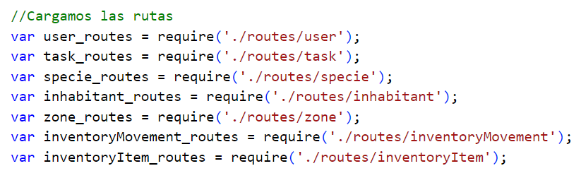
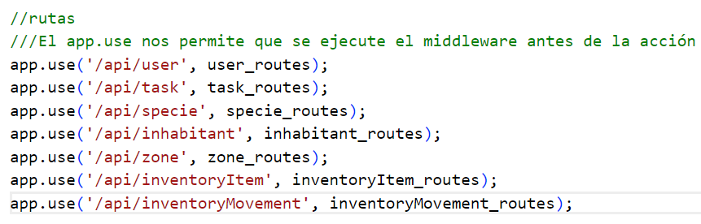
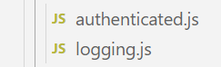
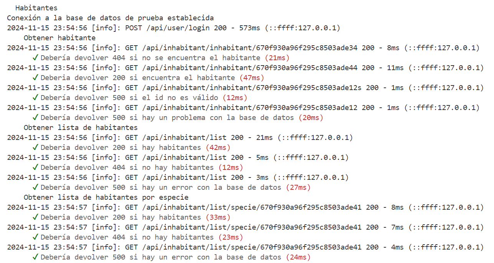
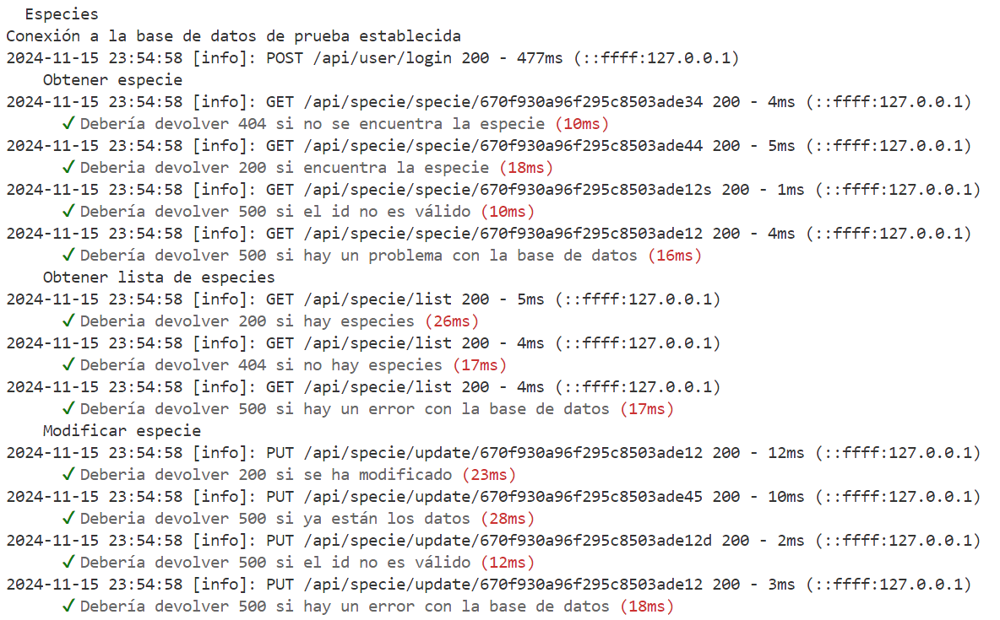
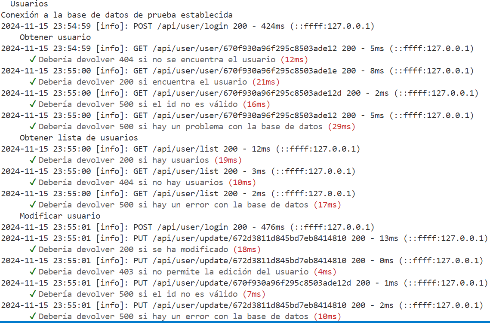
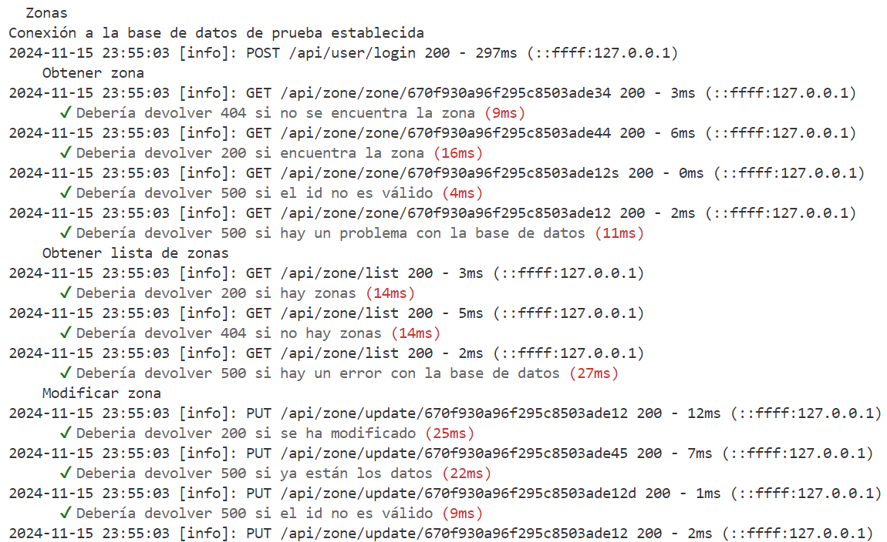

# HITO 3 - 

## FRAMEWORK DE MICROSERVICIO

### ELECCIÓN


En el proyecto, he utilizado Express como framework para el desarrollo de microservicios dentro de la pila MEAN (MongoDB, Express, Angular, Node.js). A continuación, explico por qué se ha elegido Express y cómo encaja perfectamente en nuestra arquitectura.

**Express** es un framework web minimalista y flexible para Node.js, diseñado para facilitar la creación de aplicaciones web y APIs. Este framework proporciona un conjunto robusto de herramientas para gestionar rutas, middleware y operaciones comunes, lo que permite construir microservicios de manera rápida y eficiente.

#### Razones para elegir Express:

**Simplicidad y Flexibilidad:** Express es extremadamente ligero y flexible, lo que permite personalizar la arquitectura de la aplicación según las necesidades específicas del proyecto. No impone una estructura rígida, lo que facilita adaptarlo al flujo de trabajo sin limitaciones innecesarias.

**Middleware y Routing:** El uso de middleware en Express facilita la gestión de tareas como la autenticación, validaciones y la gestión de errores de manera centralizada. Esto es crucial para mantener el código limpio y modular.
El sistema de rutas de Express es sencillo y eficiente, permitiendo la creación de los endpoints que exponen las APIs y la manipulación de peticiones HTTP (GET, POST, PUT, DELETE).

**Desarrollo rápido de APIs RESTful:** En una arquitectura de microservicios, la creación de APIs RESTful es fundamental. Express permite desarrollar estos servicios de forma ágil y sencilla, utilizando JSON para el intercambio de datos, lo cual es ideal para la comunicación entre microservicios.

**Gran Ecosistema de Paquetes:** Al formar parte del ecosistema Node.js, Express da acceso a una amplia gama de módulos y librerías a través de npm, lo que facilita la integración con bases de datos, herramientas de autenticación y otras funcionalidades esenciales para los microservicios.

**Desempeño y Escalabilidad:** Express es conocido por su rapidez y bajo consumo de recursos, lo cual es crucial para la escalabilidad de los microservicios. Gracias a su naturaleza no bloqueante, permite manejar muchas peticiones simultáneas de manera eficiente, lo que es fundamental en sistemas distribuidos.

## DISEÑO DE LA API

Esta API está diseñada utilizando un enfoque por capas que desacopla las responsabilidades de las rutas, controladores, servicios y acceso a datos. A continuación se detallan las principales capas de la aplicación, cómo se gestionan las rutas y controladores, y cómo interactúan entre sí.

#### Estructura de Archivos
```
/src
  /controllers      # Contiene los controladores, que gestionan las solicitudes HTTP.
  /routes           # Contiene las rutas de la API.
  /services         # Contiene la lógica de negocio.
  /test             # Contiene los tests de la aplicación.
  /uploads          # Contiene los ficheros subidos a la app
  /logs             # Contiene los logs generados
  /models           # Contiene las definiciones de los modelos.
  /middlewares      # Contiene los middlewares (como el de logging).
  app.js            # Archivo principal para la configuración de la API.
```

### RUTAS
Las rutas son responsables de definir los puntos de entrada a la API, utilizando los métodos HTTP apropiados (GET, POST, PUT, DELETE) y mapeándolos a los controladores correspondientes. Las rutas pueden ser definidas de manera centralizada o modularizada según la entidad.

#### RUTAS DEL SISTEMA
[En este fichero](https://github.com/SergioHrvas/CloudComputing1MII/blob/main/hitos/h3b.md) se especificarán las rutas realizadas.

#### MONTAJE DE RUTAS EN EL ARCHIVO PRINCIPAL (app.js)

En primer lugar, cargamos las rutas de los ficheros en la aplicación.




Y ahora las montamos sobre /api/\<modelo\> (por ejemplo).



### CONTROLADORES

Los controladores se encargan de recibir las solicitudes HTTP, procesar la lógica de negocio directamente y devolver las respuestas adecuadas al cliente. En este caso, la lógica no está delegada a servicios, sino que se implementa en el propio controlador.


### MIDDLEWARES 

Los **middlewares** son funciones que tienen acceso al objeto de solicitud (`req`), al objeto de respuesta (`res`) y a la siguiente función de middleware en el ciclo de solicitud-respuesta de Express. Los middlewares se utilizan para realizar tareas como la validación de solicitudes, la autenticación de usuarios, el registro de información, el manejo de errores, etc. Un middleware puede realizar acciones y luego pasar el control a la siguiente función, o detener el flujo de la solicitud si ocurre algún error o condición específica.

<center></center>

## Middleware `auth` (`mdAuth.ensureAuth`)

Este middleware se encarga de verificar si la solicitud está autenticada. Su objetivo principal es asegurarse de que solo los usuarios autenticados puedan acceder a rutas o recursos protegidos de la API.

### ¿Cómo funciona?
1. **Verificación de Token o Sesión**:  
El middleware revisa si la solicitud contiene un token de autenticación (como un JWT) o alguna otra forma de identificación del usuario.

2. **Validación del Token**:  
Si se encuentra un token en la solicitud, el middleware lo valida para asegurarse de que no haya sido alterado y que aún sea válido.

3. **Acción si no está autenticado**:  
Si el token es inválido o no se proporciona, el middleware responde con un error (generalmente un código de estado HTTP 401 - No autorizado) y detiene el flujo de la solicitud.

4. **Acción si está autenticado**:  
Si el token es válido, el middleware pasa el control al siguiente middleware o controlador.


## Middleware `log` (`requestLogger`)

El middleware `requestLogger` se utiliza para registrar información relevante sobre cada solicitud HTTP que llega a la API. Esto es útil para auditoría, depuración y monitoreo, ya que permite rastrear qué solicitudes se están haciendo, desde dónde y cuándo.

### ¿Cómo funciona?

1. **Recibe la Solicitud**:  
  El middleware se ejecuta cada vez que se recibe una solicitud HTTP en el servidor.

2. **Registra Información Importante**:  
  Se registran detalles de la solicitud, como:
    - El método HTTP (por ejemplo, GET, POST, PUT, DELETE).
    - La URL solicitada.
    - La fecha y hora exacta de la solicitud.
    - La dirección IP del cliente que realiza la solicitud.

3. **Continúa con la Solicitud**:  
  Después de registrar la información, el middleware pasa el control al siguiente middleware o controlador correspondiente.


## FRAMEWORK Y HERRAMIENTA DE LOG

### ELECCIÓN
En el caso de la pila MEAN, se ha elegido utilizar Winston como herramienta para la gestión de logs, junto con Express para manejar las peticiones HTTP.
Winston (Herramienta de Logging)

**Winston** es un popular framework de logging para Node.js, conocido por su flexibilidad y capacidad para manejar múltiples destinos de salida (transports). Se ha elegido Winston por varias razones clave:

- Flexibilidad: Winston ofrece un alto grado de personalización, lo que permite configurar diferentes niveles de log (info, debug, error, warn, etc.) para distintos entornos. Esto es esencial para distinguir entre logs de información general, advertencias o errores críticos.

- Formato de salida personalizable: Los logs generados por Winston se pueden formatear según las necesidades del proyecto, con timestamps, identificación de peticiones y otros datos importantes para hacer los registros más comprensibles.

- Desempeño y escalabilidad: Winston ha demostrado ser eficiente en la gestión de grandes volúmenes de logs, lo que es importante en sistemas distribuidos con múltiples microservicios.

### USO
La integración de Winston con Express se realiza fácilmente mediante un middleware personalizado para capturar los detalles de las peticiones HTTP y registrar la actividad en los logs. Se ha implementado un middleware en Express que intercepta las solicitudes HTTP, registrando información sobre la petición, el tiempo de respuesta y el estado de la respuesta. Esto permite generar un registro detallado de las interacciones con la API, facilitando la monitorización en tiempo real.

## EJECUCIÓN DE TESTS
*Apartado copiado del hito 2 debido a que ya se implementaron las pruebas a los endpoints para dicho hito. **Se han añadido algunas imagenes más de salidas de los tests.** Además, en este caso se pueden ver los logs en la terminal con cada prueba.*

Se han desarrollado 82 pruebas en total sobre los distintos endpoints creados. Estas pruebas abarcan tanto peticiones satisfechas con resultados correctos como errores de parámetros, de conexión, etc. Para las pruebas, en el directorio *test* del backend se ha creado un fichero por cada modelo:
  - **usuario.test.js**: Abarca las pruebas sobre las rutas relacionadas con la gestión de los usuarios, incluido el login y el registro.
  - **zone.test.js**: Pruebas sobre los endpoints de gestión de las zonas del santuario
  - **specie.test.js**: Pruebas sobre los endpoints de gestión de las especies del santuario
  - **inhabitant.test.js**: Pruebas sobre los endpoints de gestión de los habitantes del santuario

A continuación, se presenta una lista resumida de los diferentes tests implementados

### Habitantes

- **Obtener habitante**
  - Debería devolver 404 si no se encuentra el habitante (cuando el ID no existe en la base de datos).
  - Debería devolver 200 si encuentra el habitante (cuando se encuentra el habitante con el ID proporcionado).
  - Debería devolver 500 si el ID no es válido (cuando el formato del ID es incorrecto).
  - Debería devolver 500 si hay un problema con la base de datos (si ocurre un error en la conexión o consulta).

- **Obtener lista de habitantes**
  - Debería devolver 200 si hay habitantes (cuando se encuentran habitantes en la base de datos).
  - Debería devolver 404 si no hay habitantes (cuando no hay habitantes registrados en la base de datos).
  - Debería devolver 500 si hay un error con la base de datos (cuando ocurre un error al intentar obtener la lista).

- **Obtener lista de habitantes por especie**
  - Debería devolver 200 si hay habitantes (cuando se encuentran habitantes asociados a la especie).
  - Debería devolver 404 si no hay habitantes (cuando no se encuentran habitantes para la especie).
  - Debería devolver 500 si hay un error con la base de datos (cuando ocurre un error en la consulta por especie).

- **Modificar habitante**
  - Debería devolver 200 si se ha modificado (cuando se realiza la modificación correctamente).
  - Debería devolver 500 si ya están los datos (cuando los datos proporcionados ya existen en el sistema).
  - Debería devolver 500 si el ID no es válido (cuando el formato del ID es incorrecto).
  - Debería devolver 500 si hay un error con la base de datos (cuando ocurre un error durante la modificación).

- **Crear habitante**
  - Debería devolver 200 si se ha creado el habitante (cuando el habitante se registra correctamente).
  - Debería devolver 400 si no se ha enviado algún dato obligatorio (si faltan campos requeridos).
  - Debería devolver 500 si hay un error con la base de datos (si ocurre un error en la creación).

- **Eliminar habitante**
  - Debería devolver 200 si se ha eliminado el habitante (cuando se elimina el habitante correctamente).
  - Debería devolver 404 si no se ha encontrado el habitante (cuando el habitante no existe).
  - Debería devolver 500 si el ID no es válido (cuando el formato del ID es incorrecto).
  - Debería devolver 500 si hay un error con la base de datos (cuando ocurre un error en la eliminación).

<center></center>


### Especies
- **Obtener especie**
  - Debería devolver 404 si no se encuentra la especie (cuando no se encuentra la especie con el ID).
  - Debería devolver 200 si encuentra la especie (cuando la especie existe en la base de datos).
  - Debería devolver 500 si el ID no es válido (cuando el formato del ID es incorrecto).
  - Debería devolver 500 si hay un problema con la base de datos (cuando ocurre un error en la conexión).

- **Obtener lista de especies**
  - Debería devolver 200 si hay especies (cuando existen especies registradas en la base de datos).
  - Debería devolver 404 si no hay especies (cuando no hay especies en la base de datos).
  - Debería devolver 500 si hay un error con la base de datos (cuando ocurre un error en la consulta).

- **Modificar especie**
  - Debería devolver 200 si se ha modificado (cuando se actualizan los datos correctamente).
  - Debería devolver 500 si ya están los datos (cuando los datos ya existen en la base de datos).
  - Debería devolver 500 si el ID no es válido (cuando el formato del ID es incorrecto).
  - Debería devolver 500 si hay un error con la base de datos (cuando ocurre un error durante la modificación).

- **Crear especie**
  - Debería devolver 200 si se ha creado la especie (cuando la especie se registra correctamente).
  - Debería devolver 400 si el nombre de la especie está repetido (si el nombre ya existe en la base de datos).
  - Debería devolver 400 si no se ha enviado algún dato obligatorio (si faltan campos necesarios).
  - Debería devolver 500 si hay un error con la base de datos (cuando ocurre un error en la creación).

- **Eliminar especie**
  - Debería devolver 200 si se ha eliminado la especie (cuando se elimina la especie correctamente).
  - Debería devolver 404 si no se ha encontrado la especie (cuando la especie no existe en la base de datos).
  - Debería devolver 500 si el ID no es válido (cuando el formato del ID es incorrecto).
  - Debería devolver 500 si hay un error con la base de datos (cuando ocurre un error en la eliminación).

<center></center>


### Usuarios
- **Obtener usuario**
  - Debería devolver 404 si no se encuentra el usuario (cuando no existe el usuario con el ID).
  - Debería devolver 200 si encuentra el usuario (cuando el usuario se encuentra en la base de datos).
  - Debería devolver 500 si el ID no es válido (cuando el formato del ID es incorrecto).
  - Debería devolver 500 si hay un problema con la base de datos (cuando ocurre un error en la conexión).

- **Obtener lista de usuarios**
  - Debería devolver 200 si hay usuarios (cuando existen usuarios en la base de datos).
  - Debería devolver 404 si no hay usuarios (cuando no hay registros de usuarios).
  - Debería devolver 500 si hay un error con la base de datos (cuando ocurre un error en la consulta).

- **Modificar usuario**
  - Debería devolver 200 si se ha modificado (cuando el usuario se actualiza correctamente).
  - Debería devolver 403 si no permite la edición del usuario (cuando no tiene permisos).
  - Debería devolver 500 si el ID no es válido (cuando el formato del ID es incorrecto).
  - Debería devolver 500 si hay un error con la base de datos (cuando ocurre un error en la modificación).

- **Crear usuario**
  - Debería devolver 200 si se ha registrado el usuario (cuando se registra correctamente).
  - Debería devolver 400 si el correo está repetido (cuando el correo ya existe).
  - Debería devolver 400 si no se ha enviado algún dato obligatorio (si faltan campos necesarios).
  - Debería devolver 500 si hay un error con la base de datos (cuando ocurre un error en la creación).

- **Eliminar usuario**
  - Debería devolver 200 si se ha eliminado el usuario (cuando se elimina correctamente).
  - Debería devolver 404 si no se ha encontrado el usuario (cuando el usuario no existe).
  - Debería devolver 500 si el ID no es válido (cuando el formato del ID es incorrecto).
  - Debería devolver 500 si hay un error con la base de datos (cuando ocurre un error en la eliminación).

- **Login de usuario**
  - Debería devolver 200 si se ha logueado el usuario (cuando las credenciales son correctas).
  - Debería devolver 404 si no se ha encontrado el usuario (cuando el usuario no existe).
  - Debería devolver 404 si la contraseña no es válida (cuando la contraseña es incorrecta).
  - Debería devolver 500 si hay un error con la base de datos (cuando ocurre un error en la autenticación).

<center></center>


### Zonas
- **Obtener zona**
  - Debería devolver 404 si no se encuentra la zona (cuando el ID no existe).
  - Debería devolver 200 si encuentra la zona (cuando la zona se encuentra en la base de datos).
  - Debería devolver 500 si el ID no es válido (cuando el formato del ID es incorrecto).
  - Debería devolver 500 si hay un problema con la base de datos (cuando ocurre un error en la conexión).

- **Obtener lista de zonas**
  - Debería devolver 200 si hay zonas (cuando existen zonas en la base de datos).
  - Debería devolver 404 si no hay zonas (cuando no hay registros de zonas).
  - Debería devolver 500 si hay un error con la base de datos (cuando ocurre un error en la consulta).

- **Modificar zona**
  - Debería devolver 200 si se ha modificado (cuando la zona se actualiza correctamente).
  - Debería devolver 500 si ya están los datos (cuando los datos ya existen).
  - Debería devolver 500 si el ID no es válido (cuando el formato del ID es incorrecto).
  - Debería devolver 500 si hay un error con la base de datos (cuando ocurre un error en la modificación).

- **Crear zona**
  - Debería devolver 200 si se ha creado la zona (cuando se registra correctamente).
  - Debería devolver 400 si el nombre de la zona está repetido (cuando el nombre ya existe).
  - Debería devolver 400 si no se ha enviado algún dato obligatorio (si faltan campos requeridos).
  - Debería devolver 500 si hay un error con la base de datos (cuando ocurre un error en la creación).

- **Eliminar zona**
  - Debería devolver 200 si se ha eliminado la zona (cuando se elimina correctamente).
  - Debería devolver 404 si no se ha encontrado la zona (cuando la zona no existe).
  - Debería devolver 500 si el ID no es válido (cuando el formato del ID es incorrecto).
  - Debería devolver 500 si hay un error con la base de datos (cuando ocurre un error en la eliminación).

<center></center>