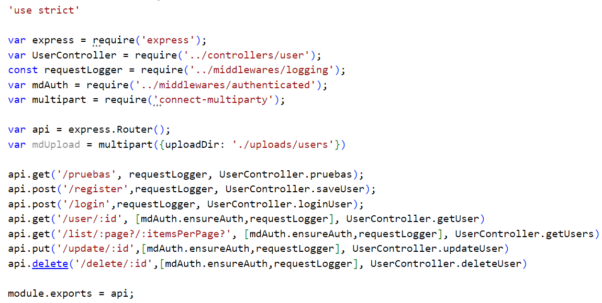
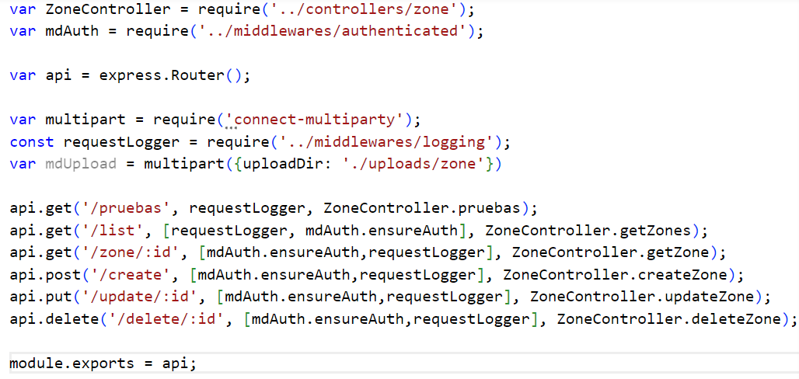
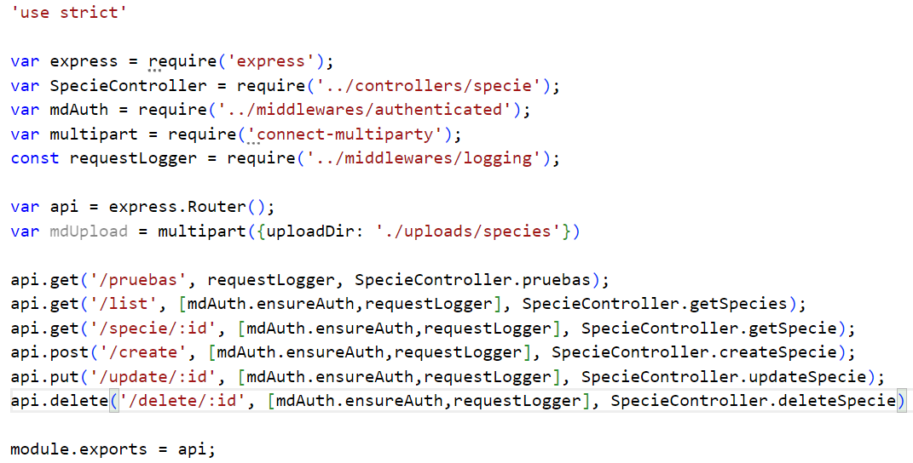
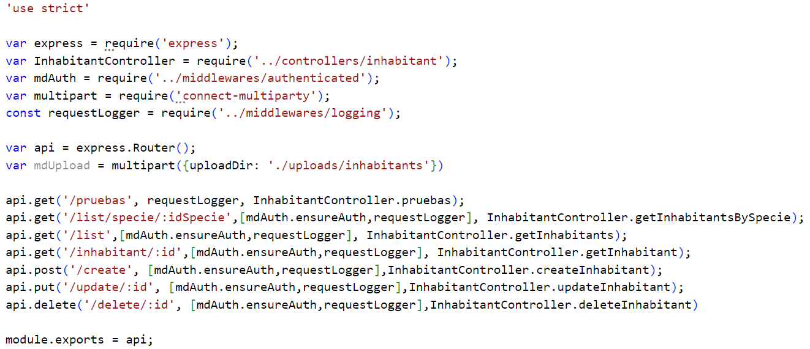

# Rutas de la API

## Usuarios

### **POST /register**
- **Descripción**:  
  Permite registrar un nuevo usuario enviando los datos necesarios en el cuerpo de la solicitud.  
- **Controlador**:  
  `UserController.saveUser`  
- **Middlewares**:  
  - `requestLogger`

---

### **POST /login**
- **Descripción**:  
  Permite a un usuario iniciar sesión proporcionando sus credenciales.  
- **Controlador**:  
  `UserController.loginUser`  
- **Middlewares**:  
  - `requestLogger`

---

### **GET /user/:id**
- **Descripción**:  
  Recupera la información de un usuario específico según el `id` proporcionado.  
- **Controlador**:  
  `UserController.getUser`  
- **Middlewares**:  
  - `mdAuth.ensureAuth`  
  - `requestLogger`

---

### **GET /list/:page?/:itemsPerPage?**
- **Descripción**:  
  Recupera una lista de usuarios con paginación opcional según los parámetros `page` e `itemsPerPage`.  
- **Controlador**:  
  `UserController.getUsers`  
- **Middlewares**:  
  - `mdAuth.ensureAuth`  
  - `requestLogger`

---

### **PUT /update/:id**
- **Descripción**:  
  Actualiza la información de un usuario existente basado en el `id` proporcionado.  
- **Controlador**:  
  `UserController.updateUser`  
- **Middlewares**:  
  - `mdAuth.ensureAuth`  
  - `requestLogger`

---

### **DELETE /delete/:id**
- **Descripción**:  
  Elimina un usuario existente según el `id` proporcionado.  
- **Controlador**:  
  `UserController.deleteUser`  
- **Middlewares**:  
  - `mdAuth.ensureAuth`  
  - `requestLogger`

## Zonas

### **GET /list**
- **Descripción**:  
  Recupera una lista de todas las zonas registradas en el sistema.  
- **Controlador**:  
  `ZoneController.getZones`  
- **Middlewares**:  
  - `requestLogger`  
  - `mdAuth.ensureAuth`

---

### **GET /zone/:id**
- **Descripción**:  
  Obtiene la información de una zona específica basada en el `id` proporcionado en la URL.  
- **Controlador**:  
  `ZoneController.getZone`  
- **Middlewares**:  
  - `mdAuth.ensureAuth`  
  - `requestLogger`

---

### **POST /create**
- **Descripción**:  
  Permite crear una nueva zona en el sistema enviando los datos necesarios en el cuerpo de la solicitud.  
- **Controlador**:  
  `ZoneController.createZone`  
- **Middlewares**:  
  - `mdAuth.ensureAuth`  
  - `requestLogger`

---

### **PUT /update/:id**
- **Descripción**:  
  Actualiza la información de una zona existente identificada por el `id` proporcionado en la URL.  
- **Controlador**:  
  `ZoneController.updateZone`  
- **Middlewares**:  
  - `mdAuth.ensureAuth`  
  - `requestLogger`

---

### **DELETE /delete/:id**
- **Descripción**:  
  Elimina una zona existente identificada por el `id` proporcionado en la URL.  
- **Controlador**:  
  `ZoneController.deleteZone`  
- **Middlewares**:  
  - `mdAuth.ensureAuth`  
  - `requestLogger`

## Especies

### **GET /list**
- **Descripción**:  
  Recupera una lista de todas las especies registradas en el sistema.  
- **Controlador**:  
  `SpecieController.getSpecies`  
- **Middlewares**:  
  - `mdAuth.ensureAuth`  
  - `requestLogger`

---

### **GET /specie/:id**
- **Descripción**:  
  Recupera la información de una especie específica identificada por el `id` proporcionado en la URL.  
- **Controlador**:  
  `SpecieController.getSpecie`  
- **Middlewares**:  
  - `mdAuth.ensureAuth`  
  - `requestLogger`

---

### **POST /create**
- **Descripción**:  
  Permite crear una nueva especie en el sistema enviando los datos necesarios en el cuerpo de la solicitud.  
- **Controlador**:  
  `SpecieController.createSpecie`  
- **Middlewares**:  
  - `mdAuth.ensureAuth`  
  - `requestLogger`

---

### **PUT /update/:id**
- **Descripción**:  
  Actualiza la información de una especie existente identificada por el `id` proporcionado en la URL.  
- **Controlador**:  
  `SpecieController.updateSpecie`  
- **Middlewares**:  
  - `mdAuth.ensureAuth`  
  - `requestLogger`

---

### **DELETE /delete/:id**
- **Descripción**:  
  Elimina una especie existente identificada por el `id` proporcionado en la URL.  
- **Controlador**:  
  `SpecieController.deleteSpecie`  
- **Middlewares**:  
  - `mdAuth.ensureAuth`  
  - `requestLogger`

## Habitantes

### **GET /list/specie/:idSpecie**
- **Descripción**:  
  Recupera una lista de todos los habitantes pertenecientes a una especie específica, identificada por el `idSpecie` proporcionado en la URL.  
- **Controlador**:  
  `InhabitantController.getInhabitantsBySpecie`  
- **Middlewares**:  
  - `mdAuth.ensureAuth`  
  - `requestLogger`

---

### **GET /list**
- **Descripción**:  
  Recupera una lista de todos los habitantes registrados en el sistema.  
- **Controlador**:  
  `InhabitantController.getInhabitants`  
- **Middlewares**:  
  - `mdAuth.ensureAuth`  
  - `requestLogger`

---

### **GET /inhabitant/:id**
- **Descripción**:  
  Recupera la información de un habitante específico identificado por el `id` proporcionado en la URL.  
- **Controlador**:  
  `InhabitantController.getInhabitant`  
- **Middlewares**:  
  - `mdAuth.ensureAuth`  
  - `requestLogger`

---

### **POST /create**
- **Descripción**:  
  Permite crear un nuevo habitante en el sistema enviando los datos necesarios en el cuerpo de la solicitud.  
- **Controlador**:  
  `InhabitantController.createInhabitant`  
- **Middlewares**:  
  - `mdAuth.ensureAuth`  
  - `requestLogger`

---

### **PUT /update/:id**
- **Descripción**:  
  Actualiza la información de un habitante existente identificado por el `id` proporcionado en la URL.  
- **Controlador**:  
  `InhabitantController.updateInhabitant`  
- **Middlewares**:  
  - `mdAuth.ensureAuth`  
  - `requestLogger`

---

### **DELETE /delete/:id**
- **Descripción**:  
  Elimina un habitante existente identificado por el `id` proporcionado en la URL.  
- **Controlador**:  
  `InhabitantController.deleteInhabitant`  
- **Middlewares**:  
  - `mdAuth.ensureAuth`  
  - `requestLogger`

## EXTRAS

### **GET /pruebas**
- **Descripción**:  
  Ruta de prueba utilizada para verificar el funcionamiento básico de las APIs. Devuelve un string.
- **Controlador**:  
  `<modelo>.pruebas`  
- **Middlewares**:  
  - `requestLogger`

---