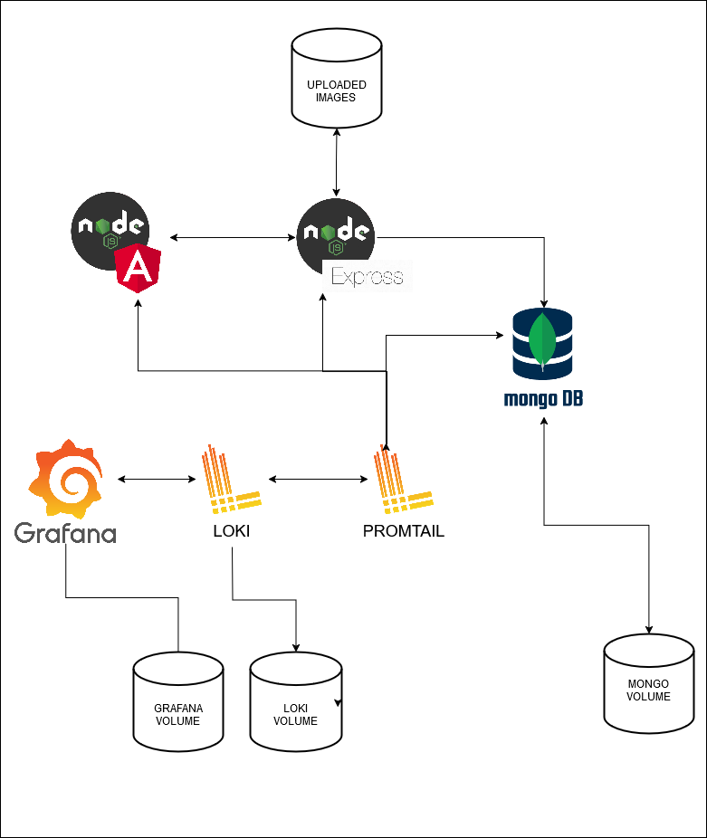
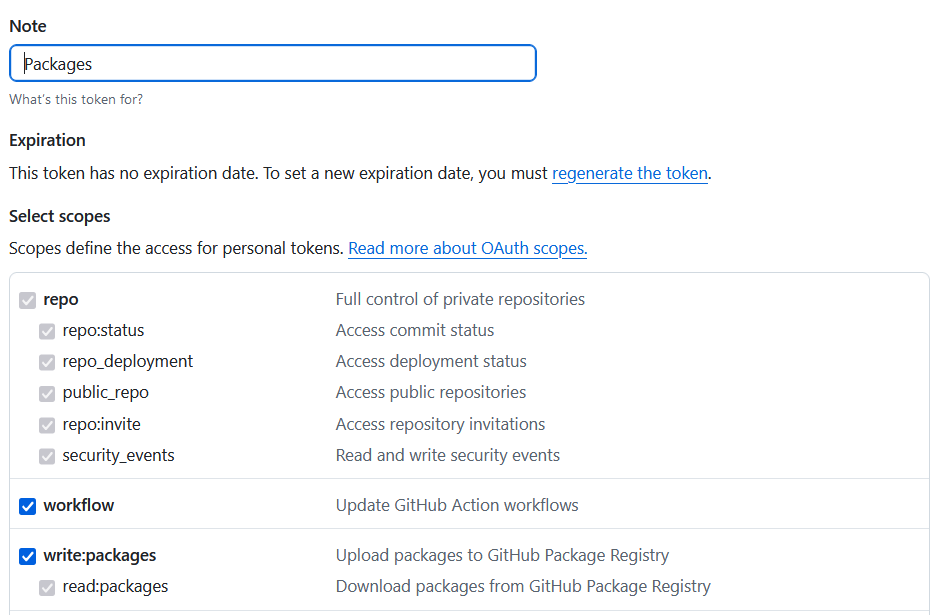
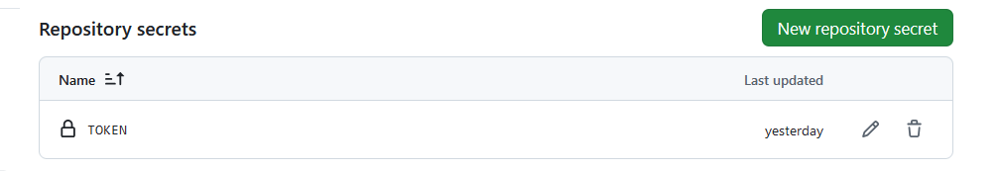
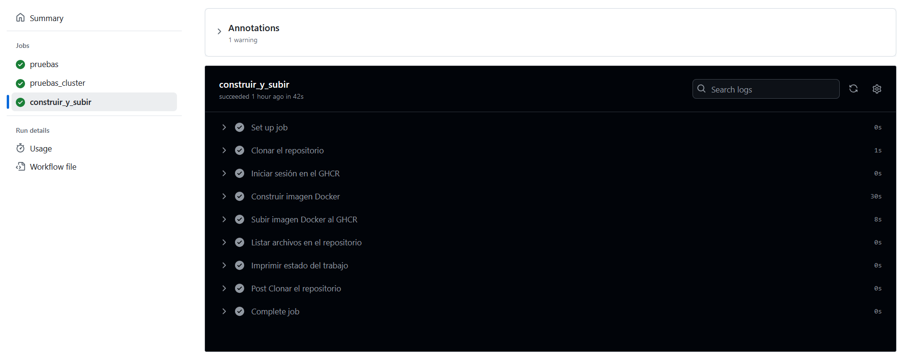
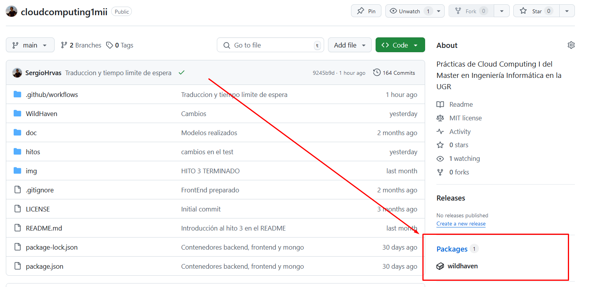
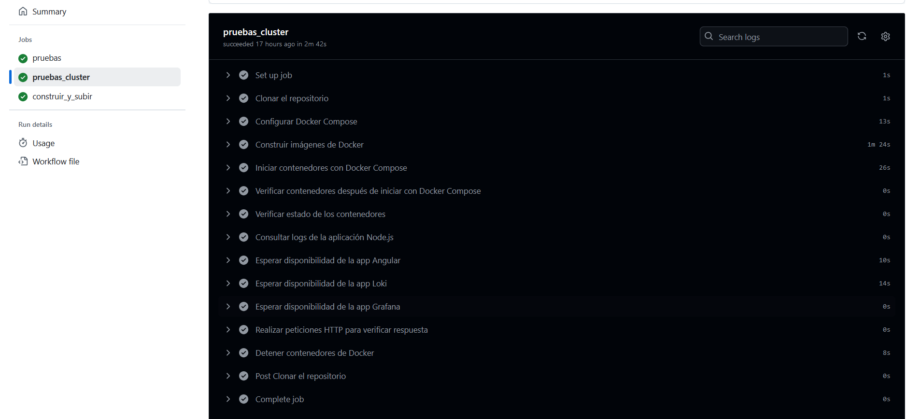

## Estructura del clúster de contenedores

### Introducción
La estructura del clúster de contenedores está diseñada para soportar una aplicación MEAN (MongoDB, Express.js, Angular, Node.js) con capacidades de monitorización y observabilidad mediante Grafana, Loki y Promtail. Este diseño asegura escalabilidad, resiliencia y una configuración modular que permite gestionar los servicios de manera eficiente.

### Descripción de los servicios y del cluster de contenedores (compose)

#### **1. MongoDB**
- **Imagen:** `mongo:latest`.
- **Propósito:** Base de datos NoSQL utilizada para almacenar la información principal de la aplicación.
- **Configuración:**
  - Variables de entorno para configurar el usuario y la contraseña del administrador.
  - Volumen persistente (`mongodb_data`) para garantizar la integridad de los datos ante reinicios o actualizaciones.
  - Conectado a la red compartida `app-network` para permitir la comunicación interna.
  - Puertos mapeados: `27017:27017` para acceso local y compatibilidad con otras herramientas de desarrollo.

#### **2. Node.js Application (Backend)**
- **Imagen construida:** Usando un `Dockerfile` desde el contexto `./backend/`.
- **Propósito:** Servidor backend que conecta la base de datos MongoDB con el frontend Angular.
- **Configuración:**
  - Variables de entorno que especifican la URL de conexión a MongoDB con credenciales seguras.
  - Volumen para sincronizar el código fuente local con el contenedor, facilitando el desarrollo.
  - Dependencia de MongoDB configurada con `depends_on`, asegurando que MongoDB se inicie antes.
  - Conexión a la red `app-network` y puertos mapeados: `3800:3800` para acceso externo al backend.

#### **3. Angular Application (Frontend)**
- **Imagen construida:** Usando un `Dockerfile` desde el contexto `./frontend/WildHaven/`.
- **Propósito:** Interfaz de usuario que interactúa con el backend.
- **Configuración:**
  - Volumen para sincronizar el código fuente y excluir dependencias de `node_modules`.
  - Conexión a la red `app-network`.
  - Puertos mapeados: `4200:4200` para el acceso a la aplicación desde navegadores.

#### **4. Loki (Logging System)**
- **Imagen:** `grafana/loki:2.8.2`.
- **Propósito:** Almacenar logs de la aplicación y los contenedores.
- **Configuración:**
  - Archivo de configuración montado desde `./loki/config/loki-config.yaml`.
  - Volumen persistente para la configuración de logs.
  - Conexión a la red `app-network`.
  - Puertos mapeados: `3100:3100` para acceso al servicio.

#### **5. Promtail (Log Aggregator)**
- **Imagen:** `grafana/promtail:2.8.2`.
- **Propósito:** Recopilar logs de los contenedores y enviarlos a Loki.
- **Configuración:**
  - Archivo de configuración montado desde `./promtail/config/promtail-config.yaml`.
  - Volumen para acceder a los logs del sistema y los contenedores Docker.
  - Comando especificado para iniciar con el archivo de configuración.

#### **6. Grafana (Dashboard de Observabilidad)**
- **Imagen:** `grafana/grafana:10.1.0`.
- **Propósito:** Proporcionar una interfaz gráfica para visualizar métricas y logs.
- **Configuración:**
  - Variables de entorno para el usuario y la contraseña del administrador.
  - Volumen persistente para guardar configuraciones y dashboards.
  - Dependencia de Loki configurada con `depends_on`.
  - Puertos mapeados: `3000:3000` para acceso al dashboard.
  - Conexión a la red `app-network`.

### Redes
- **app-network:** Red tipo `bridge` que conecta todos los servicios, permitiendo comunicación interna entre contenedores sin exponerlos a la red externa innecesariamente.

### Volúmenes
1. **mongodb_data:** Almacenamiento persistente para los datos de la base de datos.
2. **uploaded_images:** Almacén para las imágenes subidas por los usuarios.
3. **grafana_data:** Persistencia de configuraciones y dashboards de Grafana.

### Justificación
1. **Modularidad:** Cada servicio está separado en un contenedor independiente para facilitar la gestión y escalabilidad.
2. **Persistencia:** Los volúmenes aseguran que los datos críticos no se pierdan ante reinicios.
3. **Observabilidad:** La integración de Grafana, Loki y Promtail permite monitorear el estado del sistema y diagnosticar problemas en tiempo real.
4. **Seguridad:** El uso de variables de entorno para credenciales y la red interna protegen los datos y servicios.
5. **Escalabilidad:** La configuración modular permite replicar servicios fácilmente o reemplazarlos sin afectar el resto del clúster.

### Conclusión
Esta estructura proporciona una base robusta para una aplicación moderna con capacidades de desarrollo ágil, despliegue sencillo y mantenimiento eficiente. El uso de herramientas de observabilidad refuerza la confiabilidad del sistema, permitiendo una gestión proactiva y reactiva ante eventualidades.




## Configuración de los contenedores
### Loki:
  - **Imagen base:** grafana/loki:latest. Imagen oficial, diseñada para trabajar con logs y compatible con Promtail.
  - **Configuración:** Exposición del puerto 3100, montaje de volúmenes para almacenar logs localmente. Toda la configuración se encuentra en el archivo `loki-config.yaml`
    - **General**
      - **Autenticación**: Deshabilitada (solo para desarrollo).  
      - **Puerto**: 3100.  
      - **Nivel de logs**: `info`.
    - **Ingester**
      - **WAL**: Habilitado para evitar pérdida de datos.  
      - **Chunks**:
        - Cierre por inactividad: 5 minutos.  
        - Retención en memoria: 30 segundos.  
        - Cierre automático: 1 hora.  
    - **Esquema**
      - **Almacenamiento de índices**: `boltdb-shipper`.  
      - **Chunks**: Sistema de archivos (`filesystem`).  
      - **Rotación de índices**: Cada 24 horas.

    - **Almacenamiento**
      - **Índices y caché**: `/tmp/loki`.  
      - **Chunks**: `/tmp/loki/chunks`.

    - **Límites**
      - **Streams por usuario**: Máximo 1000.
      - **Entradas por consulta**: Máximo 5000.

    - **Logs antiguos**
      - **Retención y eliminación**: Deshabilitada.
      - **Búsqueda hacia atrás**: Sin límite.

### Grafana:
  - **Imagen base:** grafana/grafana:latest. Imagen oficial que ya incluye herramientas para crear dashboards.
  - **Configuración:** Puertos 3000, conexión con Loki como fuente de datos.


### Promtail:
  - **Imagen base:** grafana/promtail:latest. Imagen oficial que es ligera y compatible con Loki para la ingesta de logs. Toda la configuración se encuentra en el archivo `promtail-config.yaml`
    - **Servidor**
      - **Puerto**: 9080. Puerto en el que el servidor escuchará las solicitudes.
      - **Nivel de logs**: `info`. Define el nivel de detalle en los logs del servidor.

    - **Clientes**
      - **URL de destino**: Dirección del contenedor Loki para enviar los logs. `http://loki:3100/loki/api/v1/push`

    - **Scrape Configurations**
      - **Job Name**: `docker`
        - Nombre del trabajo que recolecta logs.  
      - **Static Configs**:
        - **Targets**: `localhost`  
          - Indica que se recolectan logs del host local.  
        - **Labels**:
          - Etiqueta que identifica los logs como relacionados con Docker. `job: docker` 
          - Ruta de los archivos de logs de los contenedores Docker.
          `__path__`: `/var/lib/docker/containers/*/*.log` 

### Frontend (Node + Angular):
Este Dockerfile está diseñado para facilitar el desarrollo de una aplicación Angular en un entorno aislado dentro de un contenedor.  
  - **Imagen base**: Usa la última versión de Node.js. `node:latest`  
  - **Configuración del contenedor**
      - **Directorio de trabajo**: Lugar donde se ejecutarán los comandos y se almacenará la aplicación. `/usr/src/frontend`
  - **Instalación de dependencias**:
    - Copia `package.json` y `package-lock.json` para instalar las dependencias de Node.js y Angular CLI.  
    - **Dependencias opcionales**: Desactivadas (`--no-optional`) para optimizar.  
    - **Copia del código fuente**: Copia todos los archivos de la aplicación al contenedor.  

  - **Exposición del puerto**: Puerto donde correrá la aplicación Angular.`4200`  

  - **Comando de inicio**: Ejecuta la aplicación con
     ```bash
     ng serve --host 0.0.0.0
     ```
    Esto permite que la aplicación sea accesible desde fuera del contenedor.

### Backend (Node + Express)
Este Dockerfile está diseñado para entornos de desarrollo, incluyendo dependencias de desarrollo y usando nodemon para mejorar la productividad durante la codificación.  
  - **Imagen base**: Utiliza la última versión de Node.js como base. `node:latest` 
  - **Configuración del Contenedor**
    - **Directorio de trabajo**: Carpeta dentro del contenedor donde se ejecutarán los comandos y se alojará la aplicación. `/usr/src/app`  
    - **Gestión de dependencias**:
      - **Archivos copiados**: Se copian primero para aprovechar la cache de Docker en instalaciones repetidas. `package.json` y `package-lock.json`
      - **Instalación de dependencias**: Se instalan todas las dependencias, incluidas las de desarrollo (`--production=false`).
    - **Copia del código fuente**: Se copia todo el contenido restante de la aplicación al contenedor.

    - **Exposición del puerto**: Puerto configurado para que la aplicación sea accesible desde el exterior del contenedor.`3800`
    - **Comando de inicio**: Ejecuta la aplicación con `npm start`, permitiendo usar **nodemon** para reiniciar automáticamente en caso de cambios.


## Subida a Github Packages
Se ha añadido un nuevo job a Github Actions para construir una imagen y subirla a github packages, en el repositorio de la práctica.

### Requisitos previos
1. **Estructura del repositorio:** El proyecto debe estar alojado en GitHub y tener la siguiente estructura relevante:
```
WildHaven/
├── backend/
│   └── Dockerfile
```

2. **Creamos token**: Nos vamos a la cuenta de github y creamos el token con permisos para escribir y leer paquetes.



3. **Configuración de Secretos**: En el repositorio de GitHub, se ha configurado la variable secret TOKEN con el token creado anteriormente.


### Flujo de Trabajo en GitHub Actions
El flujo automatiza los siguientes pasos:
1. Clona el repositorio.
``uses: actions/checkout@v4``
2. Inicia sesión en el GHCR utilizando el token configurado en los secretos.
``echo ${{ secrets.TOKEN }} | docker login ghcr.io -u ${{ github.actor }} --password-stdin``
3. Construye la imagen Docker desde el directorio backend.
``docker build -t ghcr.io/sergiohrvas/wildhaven:app-node ./WildHaven/backend``
4. Sube la imagen al GHCR.
``docker push ghcr.io/sergiohrvas/wildhaven:app-node``

Si hacemos un push del backend, vemos que se realiza correctamente en Github Actions:


Y se crea el paquete en el repositorio


## Test de cluster
- **Clonar el repositorio:** Clonamos el repositorio actual para que el código esté disponible en el entorno de trabajo.

```yaml
- name: Clonar el repositorio
  uses: actions/checkout@v4
  ```

- **Instalar Docker Compose**: Instalamos Docker Compose para gestionar y construir contenedores Docker.
```yaml
- name: Configurar Docker Compose
  run: |
    sudo apt-get install docker-compose -y
```

- **Construir las imágenes docker**: Construimos las imágenes de los contenedores desde los archivos de configuración especificados en docker-compose.yml.
```yaml
- name: Construir imágenes de Docker
  run: |
    docker-compose build --no-cache
  working-directory: './WildHaven'

```

- **Iniciar los contenedores**: Iniciamos los contenedores definidos en docker-compose.yml.
```yaml
- name: Iniciar contenedores con Docker Compose
  run: |
    docker-compose up -d
  working-directory: './WildHaven'
```

- **Lista los contenedores**: Listamos los contenedores que están en ejecución
```yaml
- name: Verificar contenedores después de iniciar con Docker Compose
  run: |
    docker-compose ps
  working-directory: './WildHaven'

- name: Verificar estado de los contenedores
  run: |
    docker ps -a
```

- **Consultar logs de la aplicación Node.js**: Obtenemos los registros del contenedor de la aplicación Node.js, si está en ejecución.

```yaml
- name: Consultar logs de la aplicación Node.js
  run: |
    CONTAINER_ID=$(docker ps -qf "name=node-app")
    if [ -n "$CONTAINER_ID" ]; then
      docker logs $CONTAINER_ID
    else
      echo "El contenedor node-app no está en ejecución"
    fi
```

- **Espera la disponibilidad de las aplicaciones**: Comprobamos si las aplicaciones están disponibles en un período máximo de 1 minuto.
```yaml
- name: Esperar disponibilidad de la app Angular
  run: |
    SECONDS=0
    while ! curl --fail --silent --output /dev/null http://localhost:4200; do
      echo "Esperando a que la app Angular esté disponible..."
      sleep 5
      if [ $SECONDS -ge 60 ]; then
        echo "Tiempo de espera agotado para la app Angular" && exit 1
      fi
    done
    echo "La app Angular está disponible!"
```
Se realiza lo mismo para ``node-app`` y para ``loki``

- **Verificar el estado de los contenedores**: Este paso asegura que todos los contenedores están en estado `Up`. Si alguno está en un estado problemático, como `exited` o `created`, el flujo de trabajo fallará y se detendrá.

```yaml
- name: Verificar estado de los contenedores
  run: |
    NOT_UP=$(docker ps -a --filter "status=exited" --filter "status=created" --quiet)
    if [ -n "$NOT_UP" ]; then
      echo "Algunos contenedores no están en estado 'Up':"
      docker ps -a --filter "status=exited" --filter "status=created"
      exit 1
    else
      echo "Todos los contenedores están en estado 'Up'."
    fi
```


- **Verificar respuesta de los contenedores**: Realizamos peticiones HTTP para confirmar que los contenedores responden correctamente.
```yaml
- name: Realizar peticiones HTTP para verificar respuesta
  run: |
    curl --fail --verbose http://localhost:3800/api/user/pruebas
    curl --fail --verbose http://localhost:4200/
    curl --fail --verbose http://localhost:3100/ready
    curl --fail --verbose http://localhost:3000
```

- **Detener contenedores**: Apagamos los contenedores al finalizar las pruebas.
```yaml
- name: Detener contenedores de Docker
  run: |
    docker-compose down
  working-directory: './WildHaven'
```


Si hacemos push de un commit al repositorio, vemos que se ejecuta el test correctamente, haciendose las peticiones sin problemas.

