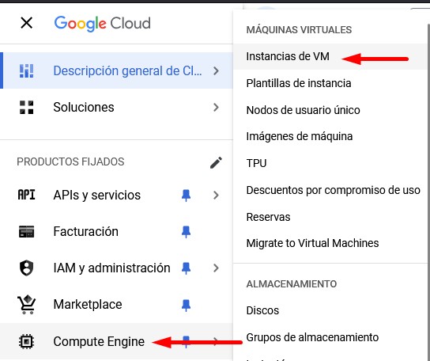
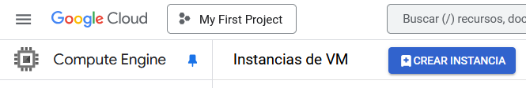
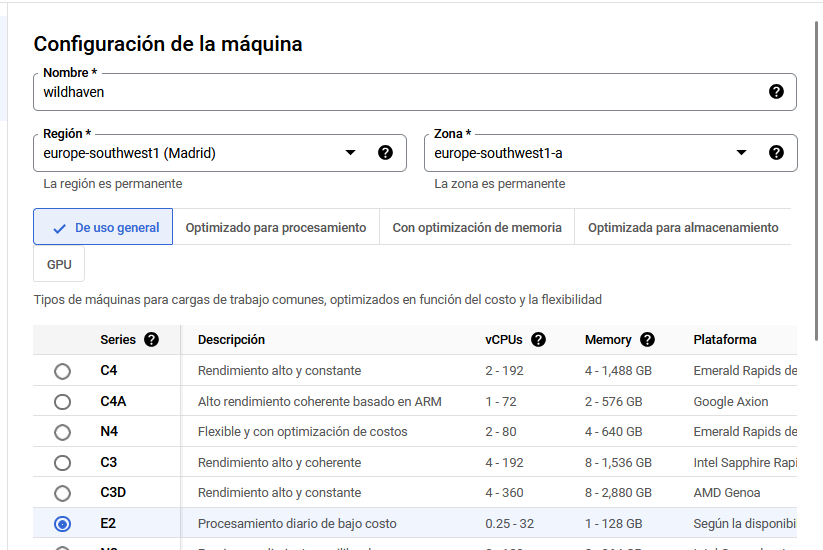
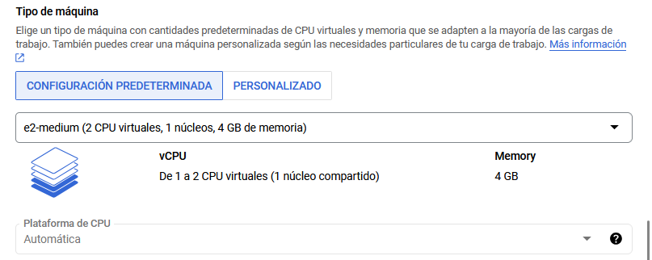
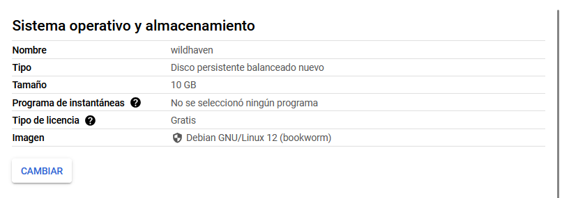
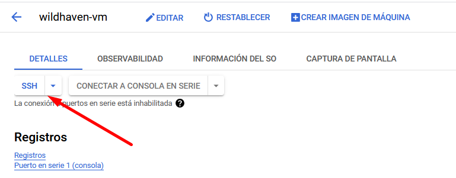
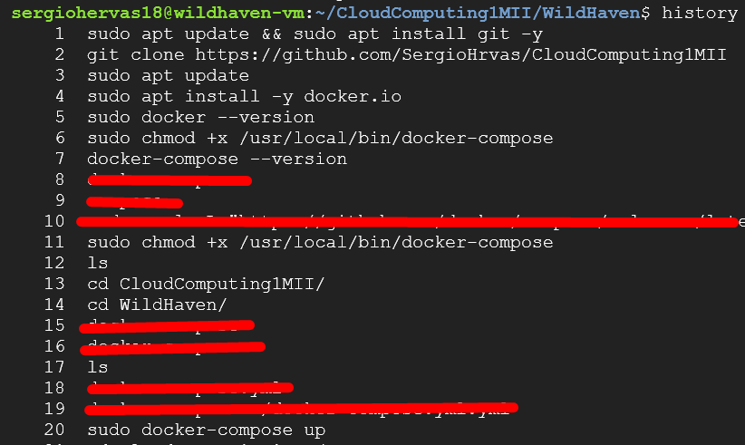
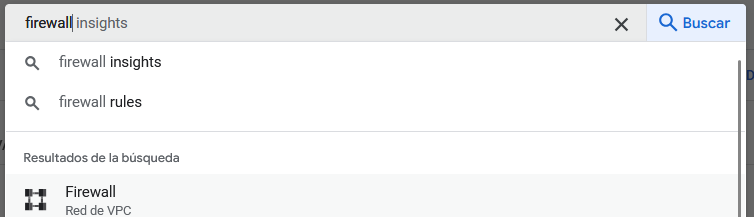
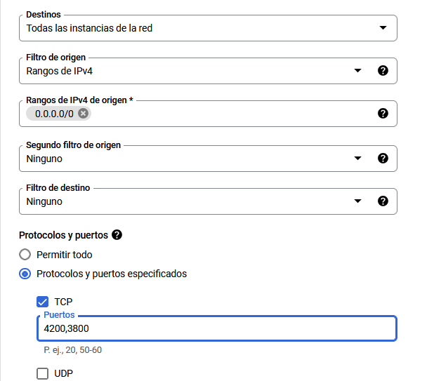

# HITO 5 - DESPLIEGUE DE LA APLICACIÓN EN UN PAAS

## Elección de PaaS/IaaS

Durante el proceso de selección de la infraestructura para desplegar el proyecto, se evaluaron tanto plataformas como servicio (PaaS) como infraestructuras como servicio (IaaS).

### Opciones valoradas de PaaS

1. **Railway:** Ofrecía una interfaz sencilla y automatización en el despliegue, pero presentó problemas de limitación de memoria de la prueba gratuita debido a las dimensiones de mi clúster de contenedores.

2. **Fly.io:** Destacado por su capacidad de geodistribución, pero pide tarjeta de crédito desde un principio e investigando he visto que tampoco soporta docker-compose, por lo que vi que no merecía la pena.

3. **Render:** Aunque ofrece simplicidad en el despliegue y escalabilidad automática, encontré problemas al desplegar mi clúster de contenedores por varios motivos:

    3.1. No ofrece compatibilidad con docker-compose

    3.2. Al intentar desplegar cada contenedor por separado mediante dockerfiles, no pude desplegar el contenedor de mongo correctamente dándome errores relacionados con el SSL y el handshake, algo que no pude configurar en la dashboard que proporciona render.

    3.3. El contenedor de frontend me daba problemas con exceso de uso de memoria debido a las limitaciones de la prueba gratuita que ofrece este PaaS

### Decisión de usar Google Cloud IaaS

Tras analizar las limitaciones de las opciones PaaS mencionadas, se optó por utilizar la infraestructura como servicio (IaaS) de Google Cloud. Esta decisión fue justificada por los siguientes motivos:

1. **Control total sobre el entorno:** Google Cloud permitió configurar el sistema operativo, las dependencias y los recursos según las necesidades específicas del proyecto, lo cual fue clave para resolver los problemas experimentados con las opciones PaaS.

2. **Estabilidad y rendimiento:** Durante las primeras pruebas que hice, Google Cloud demostró ser una solución confiable con tiempos de respuesta consistentes y alta disponibilidad.

3. **Escalabilidad personalizada:** La posibilidad de escalar los recursos de manera precisa según la carga del sistema proporcionó una ventaja frente a las soluciones PaaS que valoré

4. **Soporte robusto:** Google Cloud ofrece documentación extensa y soporte técnico de alta calidad, lo cual fue crucial para garantizar un despliegue exitoso.

5. **Rapidez de despliegue**: Solo me hizo falta crear la máquina virtual, descargar git y docker para clonar el repositorio y lanzar el clúster.

6. **Prueba gratuita amplia**: Ofrede 300$ en créditos de prueba gratuita, lo cual supera con creces la utilización que yo daré para las prácticas.

En conclusión, aunque se exploraron varias opciones PaaS, las limitaciones técnicas encontradas y la falta de tiempo para indagar mñás llevaron a seleccionar Google Cloud IaaS como la opción más adecuada para el proyecto. Esta elección garantizó flexibilidad, rendimiento y estabilidad, alineándose mejor con los requerimientos y objetivos planteados.


<center></center>

## Despliegue en Google Cloud
### 1. Creación de la máquina virtual (VM)

1. Accedemos a la consola de Google Cloud: [Google Cloud Console](https://console.cloud.google.com/).
2. Vamos al apartado **Compute Engine** > **VM instances**.
<center></center>

3. Hacemos clic en el botón **Crear instancia**.
<center></center>

4. Configuramos los parámetros de la máquina virtual:
   - Nombre: `wildhaven-vm`.
   - Región y zona: Seleccionamos alguna de europa, en mi caso, la ubicada en Madrid.
   - Tipo de máquina: Por ejemplo, `e2-medium` (1/2 vCPUs, 4 GB de RAM).

   <center></center>
   <center></center>
   - Disco de arranque:
     - Imagen: Seleccionamos `Debian` (por ejemplo) 
     - Tamaño: Al menos 20 GB.

  <center></center>
5. Hacemos clic en **Crear**.
---

### 2. Acceso a la máquina virtual

1. En la lista de instancias de VM, hacemos clic en el botón **SSH** junto a tu instancia para abrir una terminal remota.
2. Opcionalmente podríamos utilizar una herramienta externa como `gcloud` o `ssh` desde una terminal
<center></center>
---

### 3. Instalación de dependencias

Ejecutamos los siguientes comandos en la terminal de la máquina virtual:

```bash
# Actualizar el sistema
sudo apt update && sudo apt upgrade -y

# Instalar Docker
sudo apt install -y docker.io

# Verificar si tenemos las herramientas necesarias instaladas
docker --version
docker-compose --version
```

### 4. Clonación del repositorio desde GitHub
Nos aseguramos de tener git instalado:
``sudo apt install -y git``

Clonamos el repositorio del proyecto:
```bash
git clone https://github.com/tu-usuario/tu-repo.git
cd tu-repo
```
<center></center>

### 5. Lanzar Docker-Compose

Nos aseguramos de que el archivo docker-compose.yml esté en la carpeta del proyecto.

Lanzamos los servicios definidos en el archivo:

```bash
sudo docker-compose up -d
```

Verificamos que los contenedores estén corriendo:
```bash
sudo docker ps
```
<center></center>

### 6. Configuración adicional

Nos aseguramos de que los puertos necesarios (por ejemplo, 80 para HTTP o 443 para HTTPS) estén abiertos en el firewall de GCP.

Vamos a VPC Network > Firewall rules y creamos reglas para permitir el tráfico en los puertos que usamos: 4200, 3800...

<center></center>

<center></center>

<center></center>

## Despliegue automático con Github Actions

## Funcionamiento correcto

## Pruebas de prestaciones